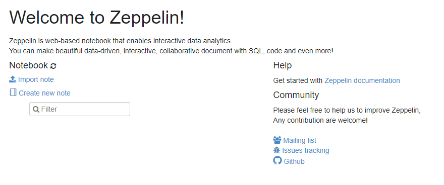

# **Laboratorio2 De BIG DATA - SPARK**

- [**Laboratorio2 De BIG DATA - SPARK**](#laboratorio2-de-big-data---spark)
  - [**Introduccion**](#introduccion)
  - [**Wordcount en el DCA**](#wordcount-en-el-dca)
    - [**Wordcount por ssh- Interactivo**](#wordcount-por-ssh--interactivo)
    - [**Wordcount atraves de  spark-submit**](#wordcount-atraves-de--spark-submit)
    - [**Wordcount atraves de zeppelin**](#wordcount-atraves-de-zeppelin)
  - [**Wordcount en el EMR**](#wordcount-en-el-emr)
    - [**Wordcount interactivo en el EMR**](#wordcount-interactivo-en-el-emr)
    - [**Wordcount con s3**](#wordcount-con-s3)
    - [**Wordcount Atraves del Notebook**](#wordcount-atraves-del-notebook)


## **Introduccion**

En este se busco el uso del framework Apache Spark, para correr el wordcount con pyspark

## **Wordcount en el DCA**

En esta seccion se busco hacer el ejercicio wordcount en el DCA academico.

### **Wordcount por ssh- Interactivo**

Como se observa en la imagen se corrio el wordcount atraves de la interfaz interactiva en el dca dando como resultado un archivo que es almacenado en el DCA


### **Wordcount atraves de  spark-submit**

Para ejecutar esto debemos crear un archivo py llamado wc-pyspark.pyspark donde este contendra el siguiente codigo.

```
from pyspark.sql import SparkSession

spark = SparkSession.builder.appName("WordCount").getOrCreate()
sc = spark.sparkContext

files_rdd = sc.textFile("s3://svalenciaa2/DatasetsSHH/gutenberg-small/*.txt")
wc_unsort = files_rdd.flatMap(lambda line: line.split()).map(lambda word: (word, 1)).reduceByKey(lambda a, b: a + b)
wc = wc_unsort.sortBy(lambda a: -a[1])
wc.coalesce(1).saveAsTextFile("hdfs:/user/svalenciaa/tmp/svalenciaawcout2")
```
Para correr este codigo se debe introducir el siguiente comando desde la consola de nuestro servidor gateway
```
spark-submit --master yarn --deploy-mode cluster wc-pyspark.py
```
Dando como resultado la ejecucion del programa


Aqui se observa el programa en ejecucion


por ultimo dando como resultado el archivo con el proceso de la aplicacion


### **Wordcount atraves de zeppelin**

Para esto ingresaremos a  https://hdpzeppelin.dis.eafit.edu.co donde podremos acceder a este



Crearemos una nueva nota


y correremos el siguiente codigo 


```
%spark2.pyspark
# WORDCOUNT COMPACTO
#files_rdd = sc.textFile("s3://emontoyapublic/datasets/gutenberg-small/*.txt")
files_rdd = sc.textFile("hdfs:///datasets/gutenberg-small/*.txt")
wc_unsort = files_rdd.flatMap(lambda line: line.split()).map(lambda word: (word, 1)).reduceByKey(lambda a, b: a + b)
wc = wc_unsort.sortBy(lambda a: -a[1])
for tupla in wc.take(10):
    print(tupla)
wc.coalesce(1).saveAsTextFile("hdfs:///tmp/<your-username>wcout1")
```
Dando como resultado la ejecucion esperada


## **Wordcount en el EMR**

### **Wordcount interactivo en el EMR**

Para la ejecucion del wordcount interactivo se debera correr el siguiente codigo

```
pyspark
files_rdd = sc.textFile("hdfs:///datasets/gutenberg-small/*.txt")
wc_unsort = files_rdd.flatMap(lambda line: line.split()).map(lambda word: (word, 1)).reduceByKey(lambda a, b: a + b)
wc = wc_unsort.sortBy(lambda a: -a[1])
for tupla in wc.take(10):
    print(tupla)
wc.saveAsTextFile("hdfs:///tmp/<your-username>wcout1")
```

Dando como resultado la ejecucion del programa


Y como resultado la creacion dela archivo en nuestro EMR


### **Wordcount con s3**

La ejecucion para la ejecucion con el bucket se deve solo remplazar la ubicacion de los datasets en este caso cambiandolo por un bucket publico

```
pyspark
files_rdd = sc.textFile("s3://<your-bucket>>/datasets/gutenberg-small/*.txt")
wc_unsort = files_rdd.flatMap(lambda line: line.split()).map(lambda word: (word, 1)).reduceByKey(lambda a, b: a + b)
wc = wc_unsort.sortBy(lambda a: -a[1])
for tupla in wc.take(10):
    print(tupla)
wc.saveAsTextFile("hdfs:///tmp/<your-username>wcout1")
wc.coalesce(1).saveAsTextFile("s3://svalenciaa2/wcout10")

```
Dando como resultado la misma ejecucion de arriba


Y con su archivo de salida correspondiente en este caso fue volcado en el EMR y en el bucket


`

### **Wordcount Atraves del Notebook**

Para la ejecucion del wordcount en el notebook se utilizara, el que provee Emr, para esto crearemos nuestro notebook y entraremos 


Ejecutamos la primeras casillas que nos cargan las dependencias y datos y hace una pequeña ejecucion para ver que si funcione


Segunda casilla


Tercera casilla


Cuarta Casilla


Quinta Casilla


En este ultima casilla se encarga del guardado de los datos tanto en HDFS como en s3

